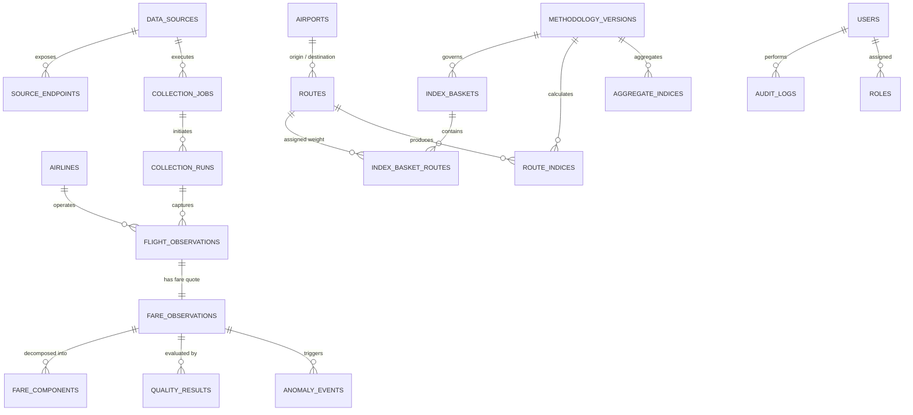

# Data Model & Entity Relationship Specification

## 1. Relational Architecture Overview
The platform utilizes PostgreSQL 16 (with optional TimescaleDB extension for hypertable partitioning) as the authoritative relational and time-series store. All primary keys are UUIDv4 to support distributed generation without coordination. All internal timestamps are stored as `TIMESTAMPTZ` in UTC.

---

## 2. Entity-Relationship Diagram (ERD)



---

## 3. Core Table Definitions

### 3.1 Geography & Reference
```sql
CREATE TABLE airports (
    id UUID PRIMARY KEY DEFAULT gen_random_uuid(),
    iata_code VARCHAR(3) UNIQUE NOT NULL,
    icao_code VARCHAR(4) UNIQUE NOT NULL,
    name VARCHAR(255) NOT NULL,
    city VARCHAR(100) NOT NULL,
    state VARCHAR(100) NOT NULL,
    country VARCHAR(100) DEFAULT 'India',
    latitude NUMERIC(9,6) NOT NULL,
    longitude NUMERIC(9,6) NOT NULL,
    timezone VARCHAR(50) DEFAULT 'Asia/Kolkata',
    is_active BOOLEAN DEFAULT TRUE,
    created_at TIMESTAMPTZ NOT NULL DEFAULT NOW()
);

CREATE TABLE routes (
    id UUID PRIMARY KEY DEFAULT gen_random_uuid(),
    origin_airport_id UUID NOT NULL REFERENCES airports(id),
    destination_airport_id UUID NOT NULL REFERENCES airports(id),
    route_code VARCHAR(10) UNIQUE NOT NULL, -- e.g. "DEL-BOM"
    distance_km NUMERIC(8,2) NOT NULL,
    dgca_category VARCHAR(50) DEFAULT 'METRO_METRO',
    is_active BOOLEAN DEFAULT TRUE,
    created_at TIMESTAMPTZ NOT NULL DEFAULT NOW(),
    CONSTRAINT chk_diff_airports CHECK (origin_airport_id <> destination_airport_id)
);
```

### 3.2 Airlines & Sources
```sql
CREATE TABLE airlines (
    id UUID PRIMARY KEY DEFAULT gen_random_uuid(),
    iata_code VARCHAR(2) UNIQUE NOT NULL, -- e.g. "6E", "AI", "QP"
    icao_code VARCHAR(3) UNIQUE NOT NULL, -- e.g. "IGO", "AIC", "AKJ"
    name VARCHAR(150) NOT NULL,
    callsign VARCHAR(100),
    country VARCHAR(100) DEFAULT 'India',
    is_active BOOLEAN DEFAULT TRUE,
    created_at TIMESTAMPTZ NOT NULL DEFAULT NOW()
);

CREATE TYPE source_type_enum AS ENUM ('DIRECT_API', 'OTA_API', 'SCRAPER', 'DEMO', 'GDS');
CREATE TYPE source_status_enum AS ENUM ('ACTIVE', 'PAUSED', 'BLOCKED', 'REQUIRES_REVIEW', 'DISABLED');

CREATE TABLE data_sources (
    id UUID PRIMARY KEY DEFAULT gen_random_uuid(),
    source_name VARCHAR(100) UNIQUE NOT NULL,
    source_type source_type_enum NOT NULL,
    base_url TEXT,
    rate_limit_per_minute INT DEFAULT 60,
    status source_status_enum DEFAULT 'ACTIVE',
    compliance_notes TEXT,
    created_at TIMESTAMPTZ NOT NULL DEFAULT NOW(),
    updated_at TIMESTAMPTZ NOT NULL DEFAULT NOW()
);
```

### 3.3 Collections & Jobs
```sql
CREATE TYPE job_status_enum AS ENUM ('QUEUED', 'RUNNING', 'SUCCESS', 'FAILED', 'RETRYING', 'CANCELLED');

CREATE TABLE collection_jobs (
    id UUID PRIMARY KEY DEFAULT gen_random_uuid(),
    source_id UUID NOT NULL REFERENCES data_sources(id),
    route_id UUID NOT NULL REFERENCES routes(id),
    departure_date DATE NOT NULL,
    advance_purchase_days INT NOT NULL, -- 1, 7, 15, 30, 45
    priority INT DEFAULT 5,
    status job_status_enum DEFAULT 'QUEUED',
    retry_count INT DEFAULT 0,
    max_retries INT DEFAULT 3,
    scheduled_at TIMESTAMPTZ NOT NULL,
    created_at TIMESTAMPTZ NOT NULL DEFAULT NOW()
);

CREATE TABLE collection_runs (
    id UUID PRIMARY KEY DEFAULT gen_random_uuid(),
    job_id UUID REFERENCES collection_jobs(id),
    source_id UUID NOT NULL REFERENCES data_sources(id),
    started_at TIMESTAMPTZ NOT NULL DEFAULT NOW(),
    completed_at TIMESTAMPTZ,
    status job_status_enum NOT NULL,
    records_observed INT DEFAULT 0,
    records_valid INT DEFAULT 0,
    error_message TEXT,
    raw_s3_path TEXT,
    created_at TIMESTAMPTZ NOT NULL DEFAULT NOW()
);
```

### 3.4 Flight & Fare Observations
```sql
CREATE TYPE cabin_class_enum AS ENUM ('ECONOMY', 'PREMIUM_ECONOMY', 'BUSINESS', 'FIRST');
CREATE TYPE validation_status_enum AS ENUM ('VALID', 'INVALID', 'REVIEW', 'MISSING');

CREATE TABLE flight_observations (
    id UUID PRIMARY KEY DEFAULT gen_random_uuid(),
    collection_run_id UUID NOT NULL REFERENCES collection_runs(id),
    airline_id UUID NOT NULL REFERENCES airlines(id),
    flight_number VARCHAR(20) NOT NULL,
    origin_airport_id UUID NOT NULL REFERENCES airports(id),
    destination_airport_id UUID NOT NULL REFERENCES airports(id),
    departure_datetime TIMESTAMPTZ NOT NULL,
    arrival_datetime TIMESTAMPTZ NOT NULL,
    is_non_stop BOOLEAN DEFAULT TRUE,
    stops_count INT DEFAULT 0,
    aircraft_type VARCHAR(50),
    collected_at TIMESTAMPTZ NOT NULL DEFAULT NOW(),
    created_at TIMESTAMPTZ NOT NULL DEFAULT NOW()
);

CREATE TABLE fare_observations (
    id UUID PRIMARY KEY DEFAULT gen_random_uuid(),
    flight_observation_id UUID NOT NULL UNIQUE REFERENCES flight_observations(id),
    source_id UUID NOT NULL REFERENCES data_sources(id),
    cabin_class cabin_class_enum DEFAULT 'ECONOMY',
    fare_class VARCHAR(10) DEFAULT 'Y',
    advance_purchase_days INT NOT NULL,
    
    base_fare NUMERIC(12,2) NOT NULL,
    user_development_fee NUMERIC(10,2) DEFAULT 0.00,
    convenience_fee NUMERIC(10,2) DEFAULT 0.00,
    fuel_surcharge NUMERIC(10,2) DEFAULT 0.00,
    taxes NUMERIC(10,2) DEFAULT 0.00,
    other_fees NUMERIC(10,2) DEFAULT 0.00,
    total_fare NUMERIC(12,2) NOT NULL,
    currency VARCHAR(3) DEFAULT 'INR',
    
    seats_remaining INT,
    source_url_or_ref TEXT,
    raw_snapshot_hash VARCHAR(64),
    raw_s3_uri TEXT,
    
    quality_score NUMERIC(5,4) DEFAULT 1.0000,
    validation_status validation_status_enum DEFAULT 'VALID',
    is_anomaly BOOLEAN DEFAULT FALSE,
    
    created_at TIMESTAMPTZ NOT NULL DEFAULT NOW()
);

CREATE TABLE fare_components (
    id UUID PRIMARY KEY DEFAULT gen_random_uuid(),
    fare_observation_id UUID NOT NULL REFERENCES fare_observations(id) ON DELETE CASCADE,
    component_name VARCHAR(100) NOT NULL, -- 'BASE', 'UDF', 'ASF', 'CGST', 'SGST'
    amount NUMERIC(10,2) NOT NULL,
    is_mandatory BOOLEAN DEFAULT TRUE,
    created_at TIMESTAMPTZ NOT NULL DEFAULT NOW()
);
```

### 3.5 Quality & Anomalies
```sql
CREATE TABLE quality_results (
    id UUID PRIMARY KEY DEFAULT gen_random_uuid(),
    fare_observation_id UUID NOT NULL REFERENCES fare_observations(id) ON DELETE CASCADE,
    check_name VARCHAR(100) NOT NULL,
    passed BOOLEAN NOT NULL,
    severity VARCHAR(20) DEFAULT 'ERROR', -- 'INFO', 'WARNING', 'ERROR'
    message TEXT,
    executed_at TIMESTAMPTZ NOT NULL DEFAULT NOW()
);

CREATE TABLE anomaly_events (
    id UUID PRIMARY KEY DEFAULT gen_random_uuid(),
    fare_observation_id UUID NOT NULL REFERENCES fare_observations(id),
    route_id UUID NOT NULL REFERENCES routes(id),
    advance_purchase_days INT NOT NULL,
    method VARCHAR(50) NOT NULL, -- 'MAD', 'IQR', 'ROBUST_ZSCORE'
    metric_value NUMERIC(12,2) NOT NULL,
    expected_range_lower NUMERIC(12,2) NOT NULL,
    expected_range_upper NUMERIC(12,2) NOT NULL,
    severity VARCHAR(20) DEFAULT 'MEDIUM',
    status VARCHAR(20) DEFAULT 'UNRESOLVED',
    detected_at TIMESTAMPTZ NOT NULL DEFAULT NOW()
);
```

### 3.6 Methodologies, Baskets & Index Outputs
```sql
CREATE TABLE methodology_versions (
    id UUID PRIMARY KEY DEFAULT gen_random_uuid(),
    version_code VARCHAR(20) UNIQUE NOT NULL, -- e.g. 'v1.0'
    formula_name VARCHAR(50) NOT NULL, -- 'JEVONS_PRICE_RELATIVE', 'LASPEYRES'
    base_period_start DATE NOT NULL,
    base_period_end DATE NOT NULL,
    base_index_value NUMERIC(8,2) DEFAULT 100.00,
    aggregation_rules JSONB NOT NULL,
    description TEXT,
    is_active BOOLEAN DEFAULT FALSE,
    activated_at TIMESTAMPTZ,
    created_at TIMESTAMPTZ NOT NULL DEFAULT NOW()
);

CREATE TABLE index_baskets (
    id UUID PRIMARY KEY DEFAULT gen_random_uuid(),
    basket_name VARCHAR(100) UNIQUE NOT NULL,
    methodology_version_id UUID NOT NULL REFERENCES methodology_versions(id),
    is_active BOOLEAN DEFAULT TRUE,
    created_at TIMESTAMPTZ NOT NULL DEFAULT NOW()
);

CREATE TABLE index_basket_routes (
    id UUID PRIMARY KEY DEFAULT gen_random_uuid(),
    index_basket_id UUID NOT NULL REFERENCES index_baskets(id),
    route_id UUID NOT NULL REFERENCES routes(id),
    weight NUMERIC(7,6) NOT NULL, -- Sum must equal 1.000000
    effective_from DATE NOT NULL,
    effective_to DATE,
    created_at TIMESTAMPTZ NOT NULL DEFAULT NOW(),
    CONSTRAINT uq_basket_route UNIQUE (index_basket_id, route_id, effective_from)
);

CREATE TABLE route_indices (
    id UUID PRIMARY KEY DEFAULT gen_random_uuid(),
    methodology_version_id UUID NOT NULL REFERENCES methodology_versions(id),
    route_id UUID NOT NULL REFERENCES routes(id),
    index_date DATE NOT NULL,
    
    current_index NUMERIC(10,4) NOT NULL,
    base_median_fare NUMERIC(12,2) NOT NULL,
    current_median_fare NUMERIC(12,2) NOT NULL,
    current_mean_fare NUMERIC(12,2) NOT NULL,
    
    observation_count INT NOT NULL,
    valid_observation_count INT NOT NULL,
    coverage_ratio NUMERIC(5,4) NOT NULL,
    
    daily_change_pct NUMERIC(6,3),
    weekly_change_pct NUMERIC(6,3),
    monthly_change_pct NUMERIC(6,3),
    
    revision_number INT DEFAULT 1,
    is_official BOOLEAN DEFAULT TRUE,
    calculated_at TIMESTAMPTZ NOT NULL DEFAULT NOW(),
    CONSTRAINT uq_route_index_date UNIQUE (methodology_version_id, route_id, index_date, revision_number)
);

CREATE TABLE aggregate_indices (
    id UUID PRIMARY KEY DEFAULT gen_random_uuid(),
    methodology_version_id UUID NOT NULL REFERENCES methodology_versions(id),
    index_basket_id UUID NOT NULL REFERENCES index_baskets(id),
    index_date DATE NOT NULL,
    
    national_index NUMERIC(10,4) NOT NULL,
    daily_change_pct NUMERIC(6,3),
    weekly_change_pct NUMERIC(6,3),
    monthly_change_pct NUMERIC(6,3),
    
    total_observations INT NOT NULL,
    total_routes_active INT NOT NULL,
    total_routes_covered INT NOT NULL,
    coverage_ratio NUMERIC(5,4) NOT NULL,
    confidence_level VARCHAR(20) DEFAULT 'HIGH', -- 'HIGH', 'MEDIUM', 'LOW'
    
    revision_number INT DEFAULT 1,
    is_official BOOLEAN DEFAULT TRUE,
    calculated_at TIMESTAMPTZ NOT NULL DEFAULT NOW(),
    CONSTRAINT uq_agg_index_date UNIQUE (methodology_version_id, index_date, revision_number)
);
```

### 3.7 Backtesting & Audit Logging
```sql
CREATE TABLE backtest_runs (
    id UUID PRIMARY KEY DEFAULT gen_random_uuid(),
    name VARCHAR(150) NOT NULL,
    methodology_version_id UUID NOT NULL REFERENCES methodology_versions(id),
    index_basket_id UUID NOT NULL REFERENCES index_baskets(id),
    start_date DATE NOT NULL,
    end_date DATE NOT NULL,
    reference_benchmark_name VARCHAR(100) DEFAULT 'DGCA_MONTHLY_AVERAGE',
    mae NUMERIC(8,4),
    rmse NUMERIC(8,4),
    mape NUMERIC(8,4),
    correlation NUMERIC(6,4),
    status VARCHAR(50) DEFAULT 'COMPLETED',
    created_at TIMESTAMPTZ NOT NULL DEFAULT NOW()
);

CREATE TABLE audit_logs (
    id UUID PRIMARY KEY DEFAULT gen_random_uuid(),
    user_id UUID,
    user_email VARCHAR(255),
    action VARCHAR(100) NOT NULL, -- e.g. 'ROUTE_WEIGHT_CHANGED'
    entity_type VARCHAR(100) NOT NULL,
    entity_id UUID NOT NULL,
    old_value JSONB,
    new_value JSONB,
    client_ip VARCHAR(50),
    user_agent TEXT,
    created_at TIMESTAMPTZ NOT NULL DEFAULT NOW()
);
```
